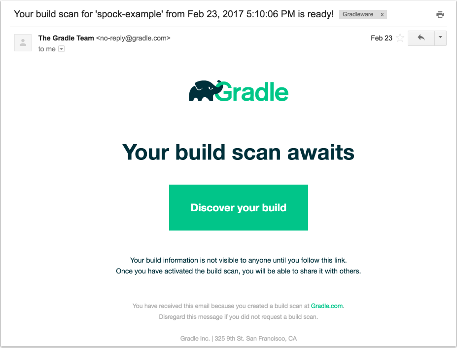

= Creating Build Scans image:https://travis-ci.org/{repo-path}.svg?branch=master["Build Status", link="https://travis-ci.org/{repo-path}"]

== Introduction

A build scan is a shareable and centralized record of a build that provides insights into what happened and why. By applying the build scan plugin to your project, you can create a build scan in the Gradle Cloud for free.

== What you'll create

This guide shows you how to modify a build script to enable build scans. Optionally, you will also modify an `init` script to enable build scans for all of your applications.

== What you'll need

* Either your own sample project, or you can use the sample available from Gradle
* Access to the Internet
* Access to your email
* About 15 minutes

== Select a sample project

Gradle makes available a simple Java project that you can use to demonstrate build scan capabilities. If you wish to use it, clone or download the repository located at https://github.com/gradle/gradle-build-scan-quickstart . If you prefer to use your own build, you can skip this step.

== Apply the build-scan plugin

Add a `plugins` block to the `build.gradle` file with the following contents:

[source, groovy]
----
plugins {
    id 'com.gradle.build-scan' version '1.6' // <1>
}
----
<1> Use latest version of plugin which can be found from the https://plugins.gradle.org/plugin/com.gradle.build-scan[Gradle Plugin Portal].

If you already have a `plugins` block, always put the build-scan plugin first. Adding it below any existing plugins will still work, but will miss useful information.

Using the `plugins` block in this way will not only download the plugin, it will apply it as well.

== Add the license agreement

In order to use the build-scan plugin, you need to agree to the terms of service. This is an automated process that you can enable by adding the following section to your build file:

[source,groovy]
----
buildScan {
    licenseAgreementUrl = 'https://gradle.com/terms-of-service'
    licenseAgree = 'yes'
}
----

The `buildScan` block allows you to configure the plugin. Here you are setting two properties necessary to agree to the terms of service. Other properties are available. See the https://docs.gradle.com/scans/[Build Scans User Manual] for details.

== Run the build scan

The scan is enabled using a command-line flag called `--scan`.

NOTE: The `--scan` option replaces the older, deprecated `-Dscan` syntax, which you will still find in some documentation.

Run a `build` task with the `--scan` option. When the build is completed, after uploading data to the Gradle servers, you will be presented with a link to follow to retrieve your report.

----
$ ./gradlew build --scan
// ... tasks related to the build ...
:build

BUILD SUCCESSFUL

Total time: x.yz secs

Publishing build information...
https://gradle.com/s/7msdnpptouxg4
----

== Access the scan online

The first time you follow the link, you will be asked to provide your email address so that a separate link can be sent to you. You will also have an opportunity to check a box to allow Gradle to remember you, so you won't have to go through the email process in the future.

The resulting email will look similar to:

Follow the link provided in the email, and you will see the resulting scan.

image::build_scan_page.png[]

You can now explore all the information contained in the build scan, including the time taken for tasks to execute, the time required during each stage of the build, the results of any tests, plugins used and other dependencies, any command-line switches used, and more.

== Enable build scans for all builds (optional)

You can avoid having to add the plugin and license agreement to every build by using a Gradle init script. Create a file called `buildScan.gradle` in the directory `~/.gradle/init.d` (where the tilde represents your home directory) with the following contents:

[source, groovy]
----
initscript {
    repositories {
        maven { url 'https://plugins.gradle.org/m2' }
    }

    dependencies {
        classpath 'com.gradle:build-scan-plugin:1.6'
    }
}

rootProject {
    apply plugin: com.gradle.scan.plugin.BuildScanPlugin

    buildScan {
        licenseAgreementUrl = 'https://gradle.com/terms-of-service'
        licenseAgree = 'yes'
    }
}
----

The init script downloads the build-script plugin if necessary and applies it to every project, and approves the license agreement. Now you can use the `--scan` flag on any build on your system.

There are additional capabilities you can add to the script, such as under what conditions to publish the scan information. For details, see the Build Scans User Manual.

== Summary

In this guide, you learned how to:

* Add the build-scan plugin to your build
* Add a `buildScan` block to agree to the terms of service
* Generate a build scan
* View the build scan information online
* Create an init script to enable scans for all builds

== Next Steps

Additional information can be found in the https://docs.gradle.com/scans/[Build Scans User Manual].
